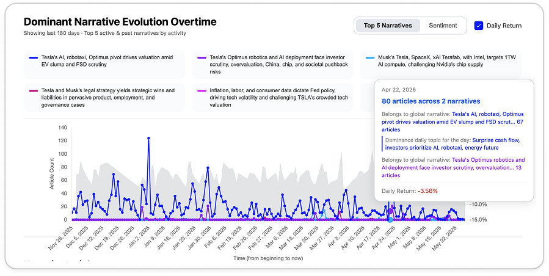

# AletaIndex Narrative Intelligence API

[](https://pypi.org/project/narrative-intelligence-mcp/)
[](https://pypi.org/project/narrative-intelligence-mcp/)
[](LICENSE)
[](https://smithery.ai/server/jamie-vw4h/aletaindex)
[](https://glama.ai/mcp/servers/AletaIndex/aletaindex-fin-narratives)

**Give your AI agent a financial narrative brain.**

AletaIndex tracks how financial stories evolve across thousands of news sources in real time — clustering articles into structured narratives, measuring sentiment momentum, and mapping narrative risk across portfolios. Available for 109 tickers across all major sectors.

Instead of raw news feeds or simple sentiment scores, your agent gets **narrative-level intelligence**: what the market is talking about, how strongly, and whether it's shifting.



---

## What Your Agent Can Do

💡 **For best results**, paste this at the start of your conversation:

```
You have access to the Aleta Index MCP, which provides narrative intelligence
derived from institutional news sources.

When analyzing stocks, prioritize the narrative layer: global narratives,
daily topics, sentiment scores, mention counts, sentiment trends, and
behavioral patterns. The narrative layer aggregates signal across hundreds
of sources and contains sufficient information for analysis — avoid reading
individual article bodies unless specifically necessary.
```

```
You: "What narratives are driving NVDA right now? Any sentiment shifts?"

Agent: NVDA is currently dominated by two narratives:
  1. "AI Infrastructure Supercycle" — 47 articles, sentiment +0.68, trending up
  2. "Export Control Headwinds" — 23 articles, sentiment -0.41, stable

  Sentiment on "Export Control Headwinds" has improved +0.12 over the past week,
  suggesting the market is pricing in less risk from the latest policy signals.
```

No prompt engineering required. The agent knows how to query the data automatically.

---

## Three Ways to Integrate

### Option A — MCP Server via PyPI (Local install, recommended)
One-line config via `uvx`. Works with Claude Code, Claude Desktop, Cursor, Windsurf, and any MCP-compatible agent.
→ [MCP Quickstart](mcp/README.md)

### Option B — MCP Directories (Zero install)
One click on Smithery or Glama. Works with Claude, Cursor, Windsurf, and any MCP-compatible agent — no local setup required.
→ [Add on Smithery](https://smithery.ai/server/jamie-vw4h/aletaindex) · [Add on Glama](https://glama.ai/mcp/servers/AletaIndex/aletaindex-fin-narratives)

### Option C — REST API
Direct HTTP calls. Works with any language or framework.
→ [API Reference](docs/api-reference.md)

---

## Pricing

| Tier | Tickers | History | Credits | Price |
|------|---------|---------|---------|-------|
| **Free Trial** | 10 tickers | 90 days | 500 (one-time) | Free, 7 days |
| **Plus** | All 109 tickers | 180 days | 2,500/month | $99/mo |
| **Scale** | All 109 tickers | Full history | Custom | Custom — [contact us](https://aletaindex-narrative.com) |

Free tickers: `TSLA` `NVDA` `AAPL` `MSFT` `AMZN` `GOOGL` `META` `AMD` `NFLX` `JPM`

**[→ Get your API key](https://aletaindex-narrative.com)**

---

## Quick Example

```python
import requests
from datetime import date, timedelta

API_KEY  = "nk_your_key_here"
BASE_URL = "https://aletaindex-narrative.com"

to_date   = date.today()
from_date = to_date - timedelta(days=6)  # 7-day window (inclusive)

resp = requests.get(
    f"{BASE_URL}/v1/narratives/comprehensive",
    headers={"X-API-Key": API_KEY},
    params={
        "tickers":   "NVDA",
        "from_date": from_date.isoformat(),
        "to_date":   to_date.isoformat(),
    },
)

data = resp.json()
for narrative in data["results"][0]["global_narratives"]:
    sentiment = narrative["sentiment"]
    print(narrative["title"], "-", sentiment["sentiment_label"], f"({sentiment['avg_sentiment']:.2f})")
```

**Example response (truncated):**

```json
{
  "results": [
    {
      "ticker": "NVDA",
      "global_narratives": [
        {
          "narrative_id": 142,
          "title": "AI Infrastructure Supercycle",
          "dominance_score": 0.847,
          "is_active": true,
          "daily_topics": [
            {
              "event_date": "2026-05-10",
              "article_count": 14,
              "sentiment": {
                "avg_sentiment": 0.71,
                "sentiment_label": "Positive",
                "trajectory": "Escalating"
              }
            }
          ]
        },
        {
          "narrative_id": 89,
          "title": "Export Control Headwinds",
          "dominance_score": 0.312,
          "is_active": true,
          "daily_topics": [
            {
              "event_date": "2026-05-10",
              "article_count": 6,
              "sentiment": {
                "avg_sentiment": -0.38,
                "sentiment_label": "Negative",
                "trajectory": "Stable"
              }
            }
          ]
        }
      ]
    }
  ]
}
```

---

## Documentation

- [API Reference](docs/api-reference.md) — endpoints, parameters, response schemas
- [Data Model](docs/data-model.md) — narrative hierarchy explained
- [MCP Quickstart](mcp/README.md) — agent integration in 2 minutes
- [Direct API Guide](docs/direct-api-guide.md) — REST integration guide
- [Example Prompts](examples/strategy-prompts.md) — prompt templates for trading agents
